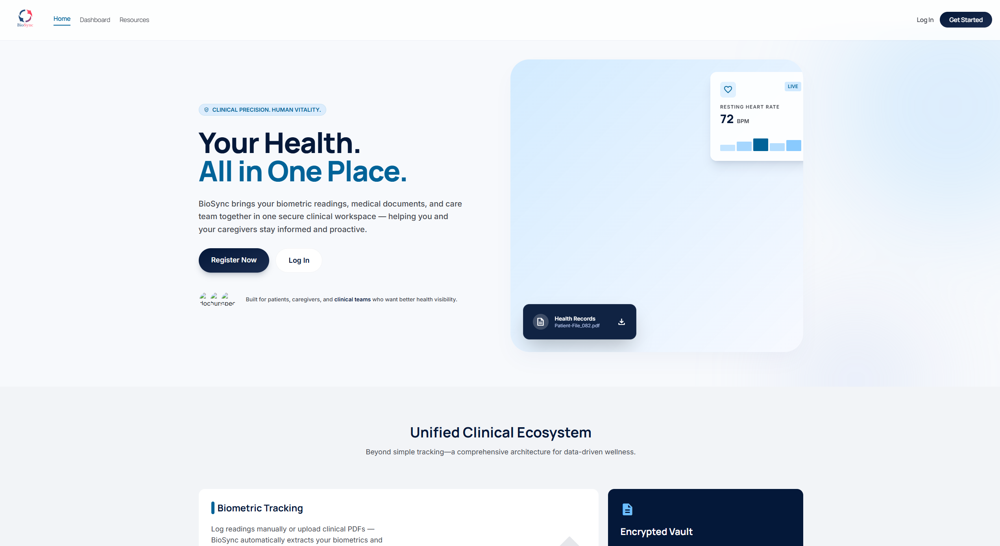

# BioSync
> A Biometric Wellness Ecosystem

**CSC 289 · Programming Capstone · Spring 2026**
**Group 2:** Joshua · Toni · Myra · Sarah

---

BioSync is a personal health tracking web app that extracts biometric data from uploaded PDF lab reports and displays trends, alerts, and historical comparisons — for both individual users and their caregivers.

## Screenshots

<!-- Take a screenshot of your dashboard and save it as docs/screenshot.png -->
<!--  -->

## Quick Start (GitHub Codespace)

1. Click **Code** → **Codespaces** → **Create codespace on main**
2. Run `bash setup.sh`
3. Run `bash run.sh`
4. Open the forwarded port URL — BioSync loads in your browser

> First time? Go to `/auth/register` to create an account, then log in at `/auth/login`.

## Features

- **PDF lab report parsing** — upload a report and biometric readings are extracted and saved automatically
- **Health trend charts** — visualize heart rate, blood pressure, glucose, SpO₂, BMI, and more over time
- **Smart health alerts** — age- and sex-adjusted notifications flag values outside safe ranges
- **Caregiver portal** — caregivers link to patients via a unique code, upload documents, and monitor readings
- **Document hub** — all uploaded medical documents organized in one place
- **Baseline comparison** — detects meaningful shifts by comparing recent readings to your personal historical average
- **Manual readings** — log biometric values directly without uploading a document

## Tech Stack

| Layer | Technology |
|-------|------------|
| Backend | Python 3.11, Flask 3.1 |
| Database | SQLite |
| Auth | Werkzeug password hashing, Flask sessions |
| Doc Parsing | pdfplumber, python-docx |
| Data Analysis | pandas, NumPy |
| Report Generation | ReportLab |
| Frontend | Jinja2, HTML, CSS, JavaScript |

## Team

| Name | Role | GitHub |
|------|------|--------|
| Joshua | [Contribution area] | [@username](https://github.com/username) |
| Toni | [Contribution area] | [@username](https://github.com/username) |
| Myra | [Contribution area] | [@username](https://github.com/username) |
| Sarah | [Contribution area] | [@username](https://github.com/username) |

## Project Showcase

Live page: [https://YOUR-ORG.github.io/BioSync-Group2](https://YOUR-ORG.github.io/BioSync-Group2)

## License

This project was created for educational purposes as part of the CSC 289 Programming Capstone at Fayetteville Technical Community College.
